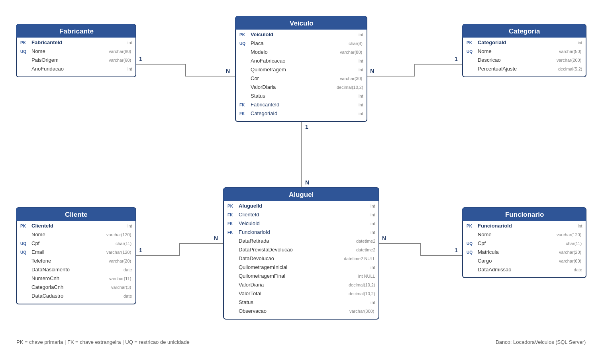

# Locadora de Veículos — Trabalho Prático 1

Aluno: Diogo — Código de Pessoa: 1285293
PUC Minas — Análise e Desenvolvimento de Sistemas

Sistema de aluguel de veículos em C# com ASP.NET Core, Entity Framework Core, SQL Server e Swagger.

| Etapa | Escopo | Situação |
|---|---|---|
| 1 | Modelagem do banco de dados | Concluída |
| 2 | Implementação do backend (API RESTful) | Concluída |
| 3 | Testes e documentação no Swagger | Pendente |
| 4 | Vídeo de apresentação (pitch) | Pendente |

---

## 1. Modelo de dados



**6 entidades**, uma a mais que o mínimo exigido:

| Entidade | Descrição |
|---|---|
| `Fabricante` | Marca do veículo |
| `Categoria` | Classificação de locação (Econômico, SUV, Executivo...) |
| `Veiculo` | Veículo da frota, com modelo, ano de fabricação e quilometragem |
| `Cliente` | Cliente da locadora, com nome, CPF e e-mail |
| `Funcionario` | Funcionário responsável pelo contrato |
| `Aluguel` | Contrato que vincula cliente, veículo e funcionário em um período |

### Chaves estrangeiras

| Constraint | Origem | Coluna | Destino |
|---|---|---|---|
| `FK_Veiculo_Fabricante` | `Veiculo` | `FabricanteId` | `Fabricante` |
| `FK_Veiculo_Categoria` | `Veiculo` | `CategoriaId` | `Categoria` |
| `FK_Aluguel_Cliente` | `Aluguel` | `ClienteId` | `Cliente` |
| `FK_Aluguel_Veiculo` | `Aluguel` | `VeiculoId` | `Veiculo` |
| `FK_Aluguel_Funcionario` | `Aluguel` | `FuncionarioId` | `Funcionario` |

Detalhamento completo do modelo (dicionário de dados, PKs, FKs, índices únicos e constraints de verificação) em `docs/Documentacao-Etapa1.pdf`.

---

## 2. Estrutura do projeto

```
LocadoraVeiculos/
├── Models/                     # Entidades do domínio
├── Data/
│   └── ApplicationContext.cs   # Mapeamento objeto-relacional (Fluent API)
├── Migrations/                 # Esquema gerado pelo Entity Framework
├── DTOs/                       # Objetos de entrada e saída, com validação
├── Controllers/
│   ├── FabricantesController.cs
│   ├── CategoriasController.cs
│   ├── VeiculosController.cs
│   ├── ClientesController.cs
│   ├── FuncionariosController.cs
│   ├── AlugueisController.cs
│   ├── ConsultasController.cs  # Filtros com joins
│   └── SeedController.cs       # Carga de registros de exemplo
├── Middleware/
│   └── TratamentoErrosMiddleware.cs
├── docs/                       # DER e documentação da Etapa 1
├── Program.cs
├── appsettings.json
└── docker-compose.yml
```

---

## 3. Como executar

```bash
docker compose up -d                        # sobe o SQL Server
dotnet restore
dotnet ef database update                   # cria o banco a partir das migrations
dotnet run --urls http://0.0.0.0:5000
```

Swagger: `http://localhost:5000/swagger`
No GitHub Codespaces, deixe a porta 5000 como pública e acesse a URL gerada + `/swagger`.

Para usar SQL Server Express instalado localmente, troque a connection string `LocadoraConnection` pelo valor de `LocadoraConnectionSqlExpress` em `appsettings.json`.

### Carga de dados para teste

```
POST /api/seed/carga-exemplo
```

Cria 3 funcionários, 5 clientes, 8 veículos e 5 aluguéis — com 2 clientes sem aluguel e 3 veículos nunca alugados, para que as consultas com LEFT JOIN retornem resultado. `DELETE /api/seed/limpar` desfaz a carga.

---

## 4. Endpoints

### CRUD

| Método | Rota | Descrição |
|---|---|---|
| GET | `/api/fabricantes` | Lista fabricantes (filtro opcional `?nome=`) |
| GET | `/api/fabricantes/{id}` | Busca por id |
| POST | `/api/fabricantes` | Cadastra |
| PUT | `/api/fabricantes/{id}` | Atualiza |
| DELETE | `/api/fabricantes/{id}` | Exclui |
| GET | `/api/categorias` | Lista categorias |
| GET | `/api/categorias/{id}` | Busca por id |
| POST | `/api/categorias` | Cadastra |
| PUT | `/api/categorias/{id}` | Atualiza |
| DELETE | `/api/categorias/{id}` | Exclui |
| GET | `/api/veiculos` | Lista veículos (filtros `?status=` e `?modelo=`) |
| GET | `/api/veiculos/{id}` | Busca por id |
| GET | `/api/veiculos/placa/{placa}` | Busca pela placa |
| POST | `/api/veiculos` | Cadastra |
| PUT | `/api/veiculos/{id}` | Atualiza |
| DELETE | `/api/veiculos/{id}` | Exclui |
| GET | `/api/clientes` | Lista clientes (filtro `?nome=`) |
| GET | `/api/clientes/{id}` | Busca por id |
| GET | `/api/clientes/cpf/{cpf}` | Busca pelo CPF |
| POST | `/api/clientes` | Cadastra |
| PUT | `/api/clientes/{id}` | Atualiza |
| DELETE | `/api/clientes/{id}` | Exclui |
| GET | `/api/funcionarios` | Lista funcionários (filtro `?cargo=`) |
| GET | `/api/funcionarios/{id}` | Busca por id |
| POST | `/api/funcionarios` | Cadastra |
| PUT | `/api/funcionarios/{id}` | Atualiza |
| DELETE | `/api/funcionarios/{id}` | Exclui |
| GET | `/api/alugueis` | Lista contratos (filtros `?status=` e `?clienteId=`) |
| GET | `/api/alugueis/{id}` | Busca por id |
| POST | `/api/alugueis` | Abre contrato e marca o veículo como alugado |
| PUT | `/api/alugueis/{id}` | Altera data prevista e observação |
| PUT | `/api/alugueis/{id}/devolucao` | Registra a devolução e libera o veículo |
| DELETE | `/api/alugueis/{id}` | Exclui o contrato |

### Filtros com joins (requisito 2.5)

| # | Rota | Joins utilizados |
|---|---|---|
| 1 | `GET /api/consultas/veiculos-disponiveis` | INNER JOIN — Veiculo × Fabricante × Categoria |
| 2 | `GET /api/consultas/alugueis-por-cliente/{cpf}` | INNER JOIN — Aluguel × Cliente × Veiculo × Fabricante × Funcionario |
| 3 | `GET /api/consultas/alugueis-em-atraso` | INNER JOIN — Aluguel × Cliente × Veiculo × Fabricante × Funcionario |
| 4 | `GET /api/consultas/alugueis-por-periodo?inicio=&fim=` | INNER JOIN — Aluguel × Cliente × Veiculo × Fabricante × Funcionario |
| 5 | `GET /api/consultas/clientes-sem-aluguel` | LEFT OUTER JOIN — Cliente × Aluguel |
| 6 | `GET /api/consultas/veiculos-nunca-alugados` | LEFT OUTER JOIN + INNER JOIN — Veiculo × Aluguel × Fabricante × Categoria |
| 7 | `GET /api/consultas/faturamento-por-categoria` | LEFT OUTER JOIN duplo com agrupamento — Categoria × Veiculo × Aluguel |

O filtro 1 aceita `?categoriaId=`, `?fabricanteId=` e `?valorMaximo=`.

### Verificação

| Rota | Retorno |
|---|---|
| `GET /api/status` | Confirma a conexão com o banco |
| `GET /api/modelo` | Lista as tabelas mapeadas com PKs e FKs |

---

## 5. Validação e tratamento de erros (requisito 2.4)

**Entrada.** Cada rota recebe um DTO com regras de `DataAnnotations`: campos obrigatórios, tamanho de texto, faixas numéricas, formato de CPF (11 dígitos), formato de e-mail e formato de placa. O contrato de aluguel implementa `IValidatableObject` para validar que a devolução prevista é posterior à retirada. Falhas retornam **400** com a lista de erros por campo.

**Regras de negócio.** Os controllers verificam duplicidade (CPF, e-mail, placa, matrícula, nome de fabricante e de categoria), existência das chaves estrangeiras informadas, disponibilidade do veículo antes de abrir um contrato, coerência da quilometragem e das datas na devolução, e bloqueiam a exclusão de registros com dependentes.

**Exceções.** O `TratamentoErrosMiddleware` captura o que escapa do pipeline e devolve JSON padronizado, registrando o erro no log sem expor detalhes internos.

### Códigos de resposta

| Código | Situação |
|---|---|
| 200 | Consulta, atualização ou exclusão bem-sucedida |
| 201 | Registro criado |
| 400 | Falha de validação ou chave estrangeira inexistente |
| 404 | Registro não encontrado |
| 409 | Duplicidade, veículo indisponível ou exclusão com dependentes |
| 500 | Erro inesperado, tratado pelo middleware |
